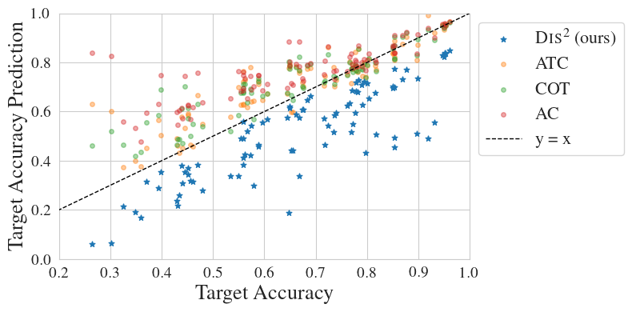
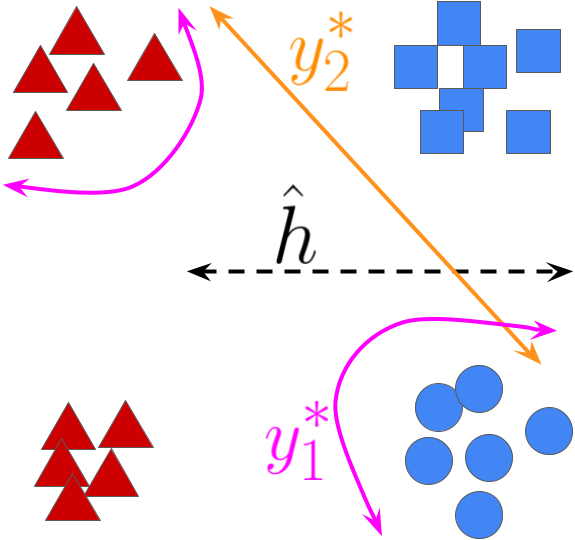

# (Almost) Provable Error Bounds Under Distribution Shift via Disagreement Discrepancy  
  
<p align="center">

</p>

  
This repository contains code for evaluating the bounds and reproducing the experiments in the paper [**(Almost) Provable Error Bounds Under Distribution Shift via Disagreement Discrepancy**](https://arxiv.org/abs/2306.00312) by [Elan Rosenfeld](https://www.cs.cmu.edu/~elan/) and [Saurabh Garg](https://saurabhgarg1996.github.io/).
  
**Dis**agreement **Dis**crepancy ($\text{Dis}^2$) is a method for giving an (almost) guaranteed upper bound on the test error of a classifier using unlabeled test data. **$\textbf{Dis}^2$ consistently gives valid, non-vacuous test error bounds,** while maintaining an average predictive accuracy (over all distribution shifts) which is competitive with SOTA baselines. In contrast, existing methods either (i) give bounds which are usually intractable and/or vacuous in practice; or (ii) only _estimate_ error and often underestimate it by a large margin, _particularly when the distribution shift is large_. 

## What's the main idea behind the bound?
The intuition behind $\text{Dis}^2$ is based on the earlier observation that [ERM May Already Learn Features Sufficient for Out-of-Distribution Generalization](https://arxiv.org/abs/2202.06856). That is, the features learned by deep neural networks are good enough that **a very simple (e.g., linear) classifier is capable of substantially higher accuracy under distribution shift.**

Even if we cannot _identify_ this classifier, we know that it exists. This means that when considering the set of _possible_ labeling functions---each of which would imply a particular drop in accuracy under shift---we need only concern ourselves with those which are "simple" and agree with the true labeling function on the training distribution. If all simple functions which agree with the training labels would imply our classifier has low error on the target data, we should consider it _more likely_ that our classifier indeed has low error than that the true labeling function is very complex.

For example: the image below depicts the task of discriminating between circles and squares, where blue is the training data and red is the shifted test data (shown as triangles, since the labels are unknown). If we've learned $\hat h$, it is *possible* that the true labels are given by $y^\*_1$, implying 100% test error---but $y^*_2$ seems much more plausible. If we imagine the labeling function is  **not *truly* worst-case adversarial,** this should allow us to give a better bound on the error of $\hat h$.

<p align="center">

</p>

$\text{Dis}^2$ relies on a **simple, intuitive condition which formalizes the above principle.** We optimize a linear classifier on deep frozen representations to maximize agreement with $\hat h$ on training data and maximize *dis*agreement on unlabeled test data. We then measure the difference between their agreement on train and test, which we refer to as the *Disagreement Discrepancy*. This gives us a high-probability upper bound on test error which holds effectively 100% of the time. In fact, in many cases we are even able to *prove* (a posteriori) that the condition holds! Please see the paper for more details.


### Code

This repository contains all the code necessary for reproducing the experiments in the paper. 

* `src/eval` has code for evaluating $\text{Dis}^2$ (as well as baseline methods) using the features/logits of (labeled) source data and (unlabeled) target data extracted from a pretrained deep neural network.

Example usage:

`python -m src.eval.dis2 --feats_dir FEATURE_DIRECTORY --results_dir RESULTS_DIRECTORY`

* `src/plot` has code for reproducing all of the plots in the paper.

Example usage:

`python -m src.plot.compare_methods_acc_vs_pred --dis2_results_fname DIS2_RESULTS_FILENAME --other_results_fname OTHER_METHODS_RESULTS_FILENAME --plot_dir OUTPUT_DIRECTORY`

* The features, labels, and linear head for evaluating the logits can be downloaded at [this Google drive link](https://drive.google.com/file/d/14Jh0C1MrBre0RebYSbEU4qrznDYMDyr_/view).

(SHA-256 checksum: `8a079e55cc03c6e2cd684dc705b5d79afe0c5e41f0010e8e869a7803695182ba`)

### Citation
If you use our method or this repository, please cite:
```bibtex
@article{rosenfeld2023almost,
    url     = {https://arxiv.org/abs/2306.00312},
    author  = {Rosenfeld, Elan and Garg, Saurabh},
    title   = {({A}lmost) Provable Error Bounds Under Distribution Shift via Disagreement Discrepancy},
    journal={arXiv preprint arXiv:2306.00312},
    year = {2023}
}
```
